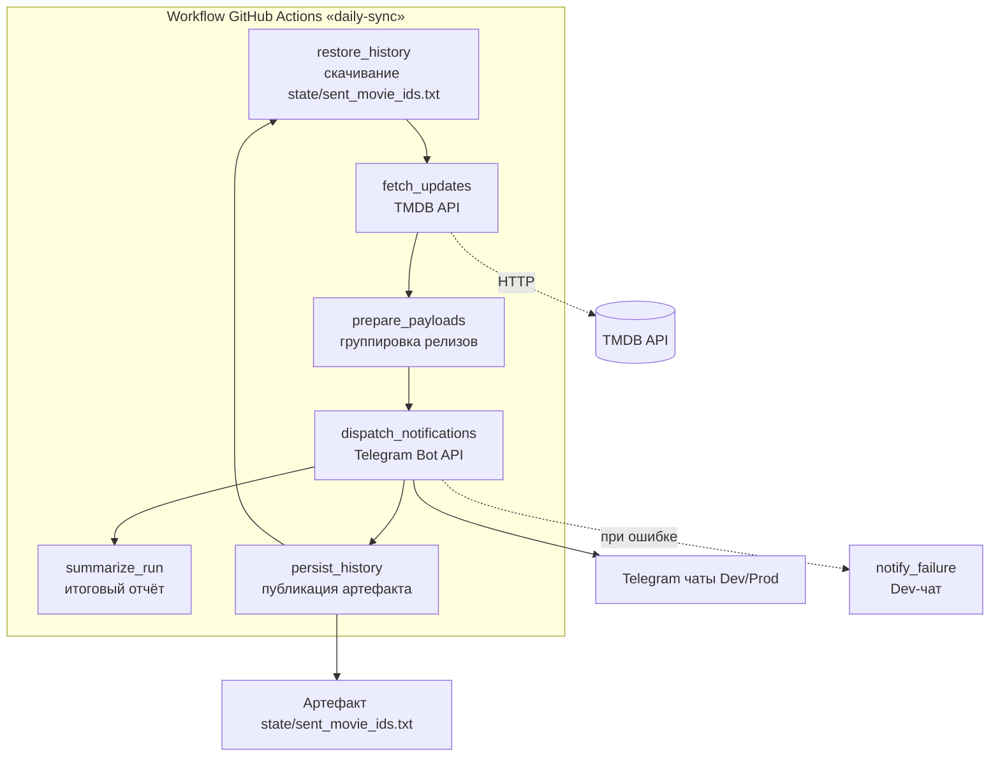

# Movie Notifier Bot — операционная спецификация

## Архитектура и общий поток данных
- **Безсерверная модель исполнения:** Все задачи выполняются внутри GitHub
  Actions; отдельный сервер или долгоживущие процессы не требуются.
- **Планировщик:** Workflow `.github/workflows/daily-sync.yml` запускается раз в
  сутки в 12:00 по московскому времени (`0 9 * * *` по UTC). В рамках одного
  прогона job `fetch_digital_releases` обращается к API и формирует сообщения
  для Telegram.
- **Окно выборки:** Для учёта задержек распространения данных TMDB опрашивается
  за интервал `[now-24h-5m, now]`, что обеспечивает пятиминутное перекрытие
  относительно предыдущего запуска и исключает пропуски релизов.
- **Структура пайплайна:**
  0. Шаг `initialize_clients` — загрузка секретов `TMDB_API_KEY`,
     `TELEGRAM_BOT_TOKEN`, `TELEGRAM_CHAT_ID` из переменных окружения и создание
     реальных клиентов `TmdbClient` (на базе `reqwest` с TLS) и
     `TelegramDispatcher` для работы с prod-ботом.
  1. Шаг `restore_history` — загрузка текстового файла
     `state/sent_movie_ids.txt` с идентификаторами фильмов, отправленных в
     предыдущем прогоне. Файл хранится как артефакт workflow; для доступа
     используется GitHub API с токеном `GITHUB_TOKEN`. При старте приложения
     `SentHistory::restore` восстанавливает файл локально и сразу передаёт
     считанные ID в `TmdbClient`, чтобы отфильтровать дубликаты до обращения к
     API TMDB.
  2. Шаг `fetch_updates` — запрос к TMDB API с учётом временного окна и
     исключением фильмов, уже присутствующих в `sent_movie_ids.txt`.
  3. Шаг `prepare_payloads` — группировка релизов по целевым чатам Telegram и
     формирование текстовых блоков.
  5. Шаг `dispatch_notifications` — отправка сообщений через Telegram Bot API.
  6. Шаг `persist_history` — дополнение списка отправленных идентификаторов
     новыми значениями и публикация обновлённого файла как артефакта текущего
     запуска (сохраняется 90 дней). После успешной отправки обновлённый файл
     `state/sent_movie_ids.txt` перезаписывается на диске и отправляется в
     артефакты, чтобы следующий прогон мог сразу восстановить актуальную
     историю. Файл представляет собой набор TMDB ID, разделённых переводами
     строк.
  6. Шаг `summarize_run` — агрегирование итогов прогона и публикация в summary
     GitHub Actions количества найденных, отправленных и пропущенных (как
     дубликаты) фильмов.
  7. Вся последовательность шагов инкапсулирована в модуле
     `src/orchestrator.rs`, который управляет состоянием между этапами и
     формирует итоговый отчёт за прогон, доступный как в логах, так и для
     дальнейших интеграций.

### Визуализация архитектуры

## Окружения и политика доставки
- **Разделение чатов:** предусмотрены два независимых канала: DevChat для
  разработки и ProdChat для реальных пользователей.
- **Текущий режим:** пока активен только Dev-стек. Все запуски (локально и в CI)
  должны использовать одинаковые по имени переменные `TELEGRAM_BOT_TOKEN` и
  `TELEGRAM_CHAT_ID`, но с Dev-значениями, чтобы исключить путаницу с
  конфигурацией.
- **Выход в прод:** Prod-окружение будет задействовано позже. Доставка в
  ProdChat разрешена только после успешной отправки в DevChat в рамках того же
  запуска. Планируется последовательная схема: сначала проверочный батч в
  DevChat, затем — зеркалирование в ProdChat при отсутствии ошибок Telegram.
- **Секреты:** Prod-режим также использует `TELEGRAM_BOT_TOKEN` и
  `TELEGRAM_CHAT_ID`, но подставляет значения из продакшн-набора секретов.
  Переход в прод сопровождается включением соответствующих секретов в GitHub
  Actions и явным шагом проверки успешной Dev-отправки.

## Использование TMDB API
- **Базовый эндпоинт:** `https://api.themoviedb.org/3/discover/movie` с
  параметрами `sort_by=primary_release_date.asc`, `with_release_type=4` (только
  цифровые релизы).
- **Фильтр по времени:** применяются параметры
  `primary_release_date.gte=<ISO-8601(now-24h-5m)>` и
  `primary_release_date.lte=<ISO-8601(now)>`. Такой подход доступен в
  TMDB и позволяет ограничить выборку по окну времени с перекрытием относительно
  предыдущего прогона.
- **Структура ответа:** JSON, поле `results` — массив объектов вида `{ title,
  release_date, original_language, popularity, id }`. Для каждого `id` при
  необходимости выполняется второй запрос `GET /3/movie/{id}` для получения
  `homepage` и `watch/providers`.
- **Пагинация Discover API:** выдача ограничена 20 элементами на страницу;
  ответ содержит `total_pages`. Клиент должен последовательно выполнять запросы
  для страниц `1..=total_pages` (с теми же фильтрами окна и `with_release_type`)
  и объединять все элементы, иначе часть релизов выпадет из выборки и бот не
  сможет их отправить.
- **DTO клиента:** модуль `tmdb` определяет `ReleaseWindow` (границы интервала в
  `DateTime<Utc>`), `MovieRelease` (агрегированные поля `id`, `title`,
  `release_date`, `original_language`, `popularity`, `homepage`,
  `watch_providers`) и `TmdbClient`. Метод `fetch_digital_releases` использует
  параметры окна, сортировку и `with_release_type=4`, а затем отбрасывает ID,
  уже встречавшиеся в файле истории `state/sent_movie_ids.txt`. Для каждого
  релиза вызывается вспомогательный `fetch_movie_details(movie_id)`, который
  делает `GET /3/movie/{id}?append_to_response=watch/providers` и сразу
  возвращает `homepage`, агрегированный список площадок и расширенные детали
  фильма. После загрузки всех страниц Discover API применяется фильтр
  `is_relevant_release` для исключения нерелевантных релизов, прежде чем
  формировать итоговую коллекцию.
- **Критерии релевантности TMDB:**
  - страна производства содержит хотя бы один код из списка `US`, `GB`, `CA`,
    `AU`, `FR`, `DE`, `IT`, `ES`, `JP`, `KR`;
  - `vote_count >= 20` и `vote_average >= 4.0`;
  - отсутствуют жанры `Documentary`, `TV Movie`, `Music`, `Reality`;
  - `runtime >= 60` минут (отсутствие данных о длительности приравнивается к
    отклонению).
- **Ограничения:** Суточный запуск укладывается в базовые лимиты TMDB;
  дополнительных задержек между запросами не требуется, кроме случаев
  отладки.

## Формирование сообщений для Telegram
- **Группировка:** Один батч сообщений на чат, перечисляющий все релизы окна.
  Конфигурация описывает список чатов и локалей, за которые каждый чат
  отвечает. Фильм попадает во все чаты, локали которых совпадают с локалью
  релиза (пустой список локалей означает подписку на все релизы).
- **Структура сообщения:**
  - строка-заголовок `*Новые цифровые релизы*`;
  - далее строки `🔥 *Название* — \`ДД.ММ.ГГГГ ЧЧ:ММ\` (площадки)` для
    приоритетных фильмов и `• *Название* — \`ДД.ММ.ГГГГ ЧЧ:ММ\` (площадки)`
    для остальных;
  - площадки перечисляются через запятую, при отсутствии выводится дефис.
- **Приоритет:** Релизы, вышедшие за последние 24 часа относительно текущего
  запуска, получают маркер `🔥` и поднимаются в начало списка чата.
- **Пустые обновления:** Если новых релизов нет, отправка пропускается.
- **Формат:** Маркдаун (режим `MarkdownV2`) с обязательным экранированием
  helper'ом `escape_markdown_v2`, который экранирует `_ * [ ] ( ) ~ ` > # + - = | { } . ! \`.

## Telegram Dispatcher
- **Реализация:** модуль `src/telegram/mod.rs` предоставляет тип
  `TelegramDispatcher`, который принимает токен и список разрешённых чатов и
  использует `reqwest::Client` для последовательной доставки подготовленных
  сообщений.
- **API:** метод `send_batch(chat_id, messages)` отправляет каждый текст в
  пределах одного чата, пропуская пустые элементы и валидируя доступность чата.
- **Повторные попытки:** при ответах `429 Too Many Requests` применяется пауза,
  равная значению `retry_after`, при `5xx` выполняются повторные запросы
  (по умолчанию до трёх раз) с задержками 5, 15 и 30 секунд.
- **Логирование:** все неуспешные ответы Telegram фиксируются в логе с кодом
  статуса и телом ответа, что упрощает отладку в GitHub Actions.
- **Тестирование:** интеграционные тесты с `wiremock` имитируют Telegram API,
  проверяя успешные отправки, обработку `429` и цепочки `5xx`.

## Обработка ошибок и ограничений
- **Повторные попытки API:** До трёх повторов с экспоненциальной задержкой (5,
  15, 30 минут) при временных ошибках или `5xx`.
- **Реализация ретраев:** `TmdbClient` использует `reqwest` с таймаутом 30 секунд
  и оборачивает запросы в общий обработчик повторов. Последовательность пауз —
  5, 15 и 30 минут; ожидание выполняется через `tokio::time::sleep`. Повтор
  допускается только для `5xx` (как на уровне HTTP-ответа, так и в ошибках
  `reqwest` со статусом `5xx`). После исчерпания попыток клиент возвращает
  `RetryLimitExceeded`, предоставляя вызывающему коду возможность завершить job
  с ошибкой.
- **Ошибки Telegram:** При получении `429 Too Many Requests` используется
  значение `retry_after`; после паузы выполняется повторная отправка.
- **Логирование:** Все ошибки выводятся в лог GitHub Actions. При фатальной
  ошибке job завершается со статусом `failed`, что делает проблему видимой в
  интерфейсе Actions.
- **Финальное уведомление:** Job настроена с `continue-on-error: false`; при
  срабатывании условия `failure()` выполняется шаг `notify_failure`, который
  отправляет короткое сообщение в Dev-чат через токен `TELEGRAM_BOT_TOKEN_DEV`.

## Инфраструктурные процессы
- **Автообновление Rust:** Workflow
  `.github/workflows/rust-toolchain-update.yml` раз в сутки выполняет
  `rustup update stable` и создаёт pull request при появлении новой версии.
- **Суточный цикл:** Основной workflow `.github/workflows/daily-sync.yml`
  отвечает за запуск бота, подготовку и отправку уведомлений.
- **GitHub Releases как транспорт артефактов:** После стабилизации
  подсистемы планируется перевод сборок на модель "build once, run many".
  Каждая успешная рабочая ветка собирает бинарник, публикует его как asset
  GitHub Release и помечает версию. Продакшн-пайплайн затем скачивает последний
  помеченный релиз и использует готовый бинарник без пересборки. Такой подход
  позволяет параллельно вести разработку (каждый исполнитель может делать свои
  релизы) и при этом не затрагивать продакшн-окружение: в Actions останется
  только шаг скачивания и запуска проверенного артефакта.
- **Состояние отправленных релизов:** Шаг `persist_history` сохраняет
  `state/sent_movie_ids.txt` как артефакт. Последующие запуски через
  `restore_history` скачивают последний доступный артефакт и используют его для
  фильтрации дубликатов.

## Модуль состояния отправок
- **Расположение:** `src/state/mod.rs`. Центральный тип — `SentHistory`,
  принимающий путь к локальному файлу состояния и экземпляр клиента GitHub
  (`GitHubArtifactsClient` из `src/github/artifacts.rs`).
- **Метод `restore()`:** обращается к GitHub Artifacts API, скачивает последний
  артефакт с именем `sent-movie-ids` (или иным, заданным при
  инициализации) и распаковывает его в локальный файл. Если артефакт отсутствует
  (первый запуск), модуль пробует использовать уже существующий файл на диске.
- **Метод `persist()`:** сериализует текущий набор отправленных идентификаторов,
  перезаписывает локальный файл и публикует его как новый артефакт, чтобы
  следующий прогон workflow мог восстановиться из актуального состояния.
- **Защита от дубликатов:** методы `contains(id: MovieId)` и
  `append(new_ids: &[MovieId])` позволяют быстро проверить наличие релиза в
  истории и добавить только новые значения. `append` возвращает количество
  фактически вставленных идентификаторов.
- **Формат файла состояния:** `state/sent_movie_ids.txt` содержит набор TMDB ID,
  отсортированных по возрастанию и разделённых переводами строк. Пустые строки
  игнорируются, поэтому файл легко редактировать вручную при отладке.
- **Окружения:** Всегда есть два набора секретов. В разработке используется только
  Dev-комплект (`TELEGRAM_BOT_TOKEN_DEV`, `TELEGRAM_CHAT_ID_DEV`), чтобы все
  отправки шли в DevChat. Prod-комплект (`TELEGRAM_BOT_TOKEN_PROD`,
  `TELEGRAM_CHAT_ID_PROD`) будет задействован позже и только после успешной
  Dev-отправки в рамках одного запуска workflow.
- **Секреты:** Требуются `TMDB_API_KEY`, оба Telegram-токена и разрешение для
  `GITHUB_TOKEN` на чтение артефактов. Их наличие проверяется шагом
  `validate_secrets`, который аварийно останавливает job при отсутствии
  значений.
- **Мониторинг:** Для оперативного анализа используются стандартные логи GitHub
  Actions; дополнительных внешних сервисов мониторинга не предусмотрено.

## Целевая редакция Rust
- Проект использует редакцию **Rust 2024**.

## Политика обновления зависимостей
- Dependabot в `.github/workflows/dependabot-auto-merge.yml` запускается
  еженедельно и автоматически мержит минорные и патчевые обновления после
  прохождения тестов.
- Критические уязвимости обрабатываются внеплановыми pull request с ручным
  подтверждением ревьюера.

## Связанные workflows
- `.github/workflows/daily-sync.yml`
- `.github/workflows/rust-toolchain-update.yml`
- `.github/workflows/dependabot-auto-merge.yml`
