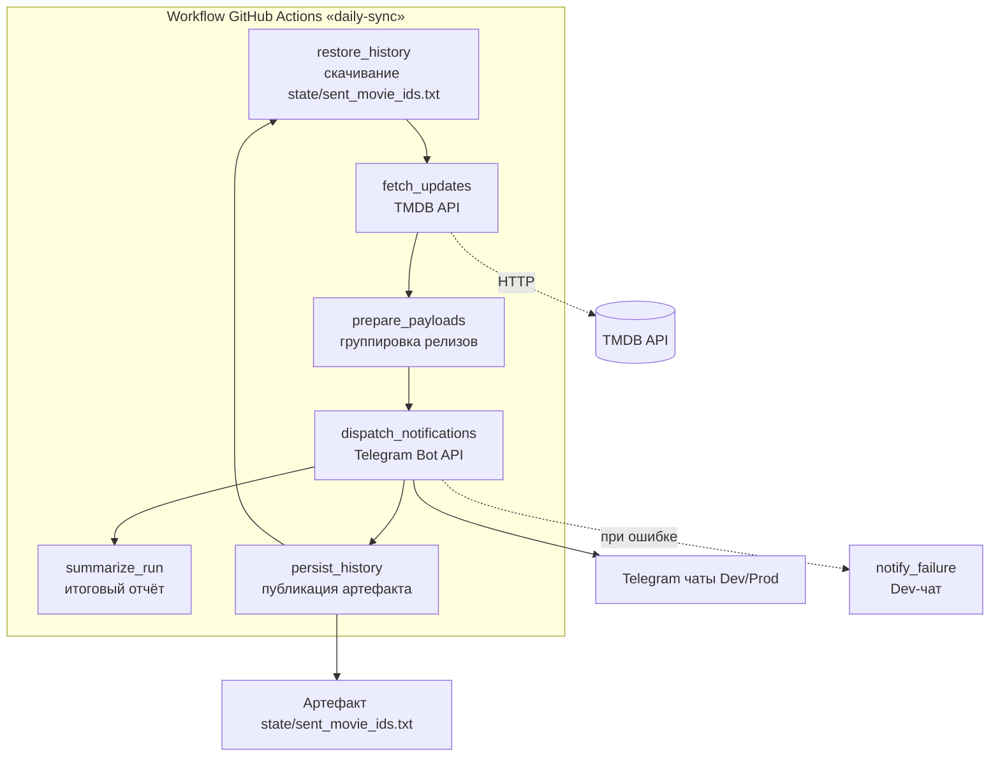

# Movie Notifier Bot — операционная спецификация

## Архитектура и общий поток данных
- **Безсерверная модель исполнения:** Все задачи выполняются внутри GitHub
  Actions; отдельный сервер или долгоживущие процессы не требуются.
- **Планировщик:** Workflow `.github/workflows/daily-sync.yml` запускается раз в
  сутки в 12:00 по московскому времени (`0 9 * * *` по UTC). В рамках одного
  прогона job `fetch_digital_releases` обращается к API и формирует сообщения
  для Telegram.
- **Окно выборки:** Для учёта задержек распространения данных TMDB опрашивается
  за интервал `[now-24h-5m, now]`, что обеспечивает пятиминутное перекрытие
  относительно предыдущего запуска и исключает пропуски релизов.
- **Структура пайплайна:**
  1. Шаг `restore_history` — загрузка текстового файла
     `state/sent_movie_ids.txt` с идентификаторами фильмов, отправленных в
     предыдущем прогоне. Файл хранится как артефакт workflow; для доступа
     используется GitHub API с токеном `GITHUB_TOKEN`.
  2. Шаг `fetch_updates` — запрос к TMDB API с учётом временного окна и
     исключением фильмов, уже присутствующих в `sent_movie_ids.txt`.
  3. Шаг `prepare_payloads` — группировка релизов по целевым чатам Telegram и
     формирование текстовых блоков.
  4. Шаг `dispatch_notifications` — отправка сообщений через Telegram Bot API.
  5. Шаг `persist_history` — дополнение списка отправленных идентификаторов
     новыми значениями и публикация обновлённого файла как артефакта текущего
     запуска (сохраняется 90 дней). Файл представляет собой набор TMDB ID,
     разделённых переводами строк.
  6. Шаг `summarize_run` — агрегирование итогов прогона и публикация в summary
     GitHub Actions количества найденных, отправленных и пропущенных (как
     дубликаты) фильмов.

### Визуализация архитектуры

## Использование TMDB API
- **Базовый эндпоинт:** `https://api.themoviedb.org/3/discover/movie` с
  параметрами `sort_by=primary_release_date.asc`, `with_release_type=4` (только
  цифровые релизы).
- **Фильтр по времени:** применяются параметры
  `primary_release_date.gte=<ISO-8601(now-24h-5m)>` и
  `primary_release_date.lte=<ISO-8601(now)>`. Такой подход доступен в
  TMDB и позволяет ограничить выборку по окну времени с перекрытием относительно
  предыдущего прогона.
- **Структура ответа:** JSON, поле `results` — массив объектов вида `{ title,
  release_date, original_language, popularity, id }`. Для каждого `id` при
  необходимости выполняется второй запрос `GET /3/movie/{id}` для получения
  `homepage` и `watch/providers`.
- **Ограничения:** Суточный запуск укладывается в базовые лимиты TMDB;
  дополнительных задержек между запросами не требуется, кроме случаев
  отладки.

## Формирование сообщений для Telegram
- **Группировка:** Один батч сообщений на чат, перечисляющий все релизы окна.
  Для каждого фильма указываются локализованное название, дата релиза и
  доступные площадки.
- **Приоритет:** Премьеры, стартующие в ближайшие сутки, выделяются маркером
  `🔥` и поднимаются в начало списка.
- **Пустые обновления:** Если новых релизов нет, отправка пропускается.
- **Формат:** Маркдаун (режим `MarkdownV2`) с экранированием специальных
  символов.

## Обработка ошибок и ограничений
- **Повторные попытки API:** До трёх повторов с экспоненциальной задержкой (5,
  15, 30 минут) при временных ошибках или `5xx`.
- **Ошибки Telegram:** При получении `429 Too Many Requests` используется
  значение `retry_after`; после паузы выполняется повторная отправка.
- **Логирование:** Все ошибки выводятся в лог GitHub Actions. При фатальной
  ошибке job завершается со статусом `failed`, что делает проблему видимой в
  интерфейсе Actions.
- **Финальное уведомление:** Job настроена с `continue-on-error: false`; при
  срабатывании условия `failure()` выполняется шаг `notify_failure`, который
  отправляет короткое сообщение в Dev-чат через токен `TELEGRAM_BOT_TOKEN_DEV`.

## Инфраструктурные процессы
- **Автообновление Rust:** Workflow
  `.github/workflows/rust-toolchain-update.yml` раз в сутки выполняет
  `rustup update stable` и создаёт pull request при появлении новой версии.
- **Суточный цикл:** Основной workflow `.github/workflows/daily-sync.yml`
  отвечает за запуск бота, подготовку и отправку уведомлений.
- **Состояние отправленных релизов:** Шаг `persist_history` сохраняет
  `state/sent_movie_ids.txt` как артефакт. Последующие запуски через
  `restore_history` скачивают последний доступный артефакт и используют его для
  фильтрации дубликатов.
- **Environments:** Предусмотрены окружения `Dev` и `Prod` с независимыми
  токенами Telegram (`TELEGRAM_BOT_TOKEN_DEV`, `TELEGRAM_BOT_TOKEN_PROD`), что
  позволяет тестировать рассылку без вовлечения продовых пользователей.
- **Секреты:** Требуются `TMDB_API_KEY`, оба Telegram-токена и разрешение для
  `GITHUB_TOKEN` на чтение артефактов. Их наличие проверяется шагом
  `validate_secrets`, который аварийно останавливает job при отсутствии
  значений.
- **Мониторинг:** Для оперативного анализа используются стандартные логи GitHub
  Actions; дополнительных внешних сервисов мониторинга не предусмотрено.

## Целевая редакция Rust
- Проект использует редакцию **Rust 2024**.

## Политика обновления зависимостей
- Dependabot в `.github/workflows/dependabot-auto-merge.yml` запускается
  еженедельно и автоматически мержит минорные и патчевые обновления после
  прохождения тестов.
- Критические уязвимости обрабатываются внеплановыми pull request с ручным
  подтверждением ревьюера.

## Связанные workflows
- `.github/workflows/daily-sync.yml`
- `.github/workflows/rust-toolchain-update.yml`
- `.github/workflows/dependabot-auto-merge.yml`
